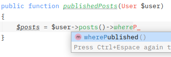
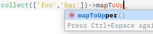
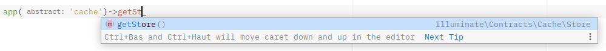

# Next Ide Helper for Laravel

[](https://packagist.org/packages/soyhuce/next-ide-helper)

[](https://packagist.org/packages/soyhuce/next-ide-helper)

This package aims to be an easy extendable ide-helper generator.

It was inspired by the great work of [barryvdh/laravel-ide-helper](https://github.com/barryvdh/laravel-ide-helper).

It provides completion for Eloquent magic (model attributes, scopes, relations, ...), registered macros of Macroable
classes, container instances, ...

All notable changes are described in the [changelog](CHANGELOG.md).

- [Installation](#installation)
- [Usage](#usage)
    - [Models](#models)
        - [Attributes](#attributes)
        - [Custom Collection](#custom-collection)
        - [Query Builder](#query-builder)
        - [Relations](#relations)
        - [Extensions](#extensions)
    - [Macros](#macros)
    - [Phpstorm meta](#phpstorm-meta)
    - [Factories](#factories)
    - [Aliases](#aliases)
    - [Generate all](#generate-all)
    - [Custom application bootstrap](#custom-application-bootstrap)
- [Contributing](#contributing)
- [License](#license)

# Installation

You should install this package using composer :

```shell script
composer require --dev soyhuce/next-ide-helper
``` 

You may want to publish configuration file :

```shell script
php artisan vendor:publish --tag=next-ide-helper:config
```

You're done !

# Usage

## Models

The command `php artisan next-ide-helper:models` will generate multiple elements to help your ide understand what you
are doing. This package needs you to have access to a migrated database.

It will add docblock to your classes and will create an `_ide_models.php` file. This file **must not** be included but
only analyzed by your ide.

### Attributes

The command resolves model attributes from the database. They are added to your model class docblock. If the attribute
has a cast, the package will cast properly the attribute.

```php
/**
 * @property int $id
 * @property string $name
 * @property string $email
 * @property \Illuminate\Support\Carbon|null $email_verified_at
 * @property string $password
 * @property string|null $remember_token
 * @property \Illuminate\Support\Carbon $created_at
 * @property \Illuminate\Support\Carbon $updated_at
 */
class User extends \Illuminate\Database\Eloquent\Model
{
    // ...
    protected $casts = [
        'email_verified_at' => 'datetime',
    ];
}
```

Attribute casting will also work with custom casts :

```php
use App\Email;

class EmailCast implements \Illuminate\Contracts\Database\Eloquent\CastsAttributes
{
    public function get($model, $key, $value, $attributes): Email
    {
        return new Email($value);
    }
    
    // ...
}

class User extends Model
{
    protected $casts = [
        'email' => EmailCast::class,
    ];
}
```

This will produce `@property \App\Email $email`

Note that the type must be defined as return type or in docblock's `@return` of the `get` method.

The command also adds attributes from accessors as read-only properties :

```php
/**
 * @property-read string $upper_name
 */
class User extends Model
{
    public function getUpperNameAttribute(): string
    {
        return Str::upper($this->name);
    }   
}
```

### Custom collection

In case your model defines a custom collection, the command will add `all` method on the model's docblock to re-define
return type :

```php
use \App\Collections\UserCollection;

/**
 * @method static \App\Collections\UserCollection all(array|mixed $columns = ['*'])
 */
class User extends Model
{
    public function newCollection(array $models = []): UserCollection
    {
        return new UserCollection($models);
    }
}
```

### Query Builder

If your model defines a custom Eloquent builder, the command will add some tags on the model docblock.

```php
use App\Builder\UserBuilder;
/**
 * @method static \App\Builder\UserBuilder query()
 * @mixin \App\Builder\UserBuilder
 */
class User extends Model
{
    public function newEloquentBuilder($query)
    {
        return new UserBuilder($query);
    }
}
```

It will also add some tags on the builder to help your ide :

- where clauses based on model attributes
- return values for result values

```php
use Illuminate\Database\Eloquent\Builder;

/**
 * @method \App\Builder\UserBuilder whereId(int|string $value)
 * @method \App\Builder\UserBuilder whereName(string $value)
 * @method \App\Builder\UserBuilder whereEmail(string $value)
 * @method \App\Builder\UserBuilder whereEmailVerifiedAt(\Illuminate\Support\Carbon|string|null $value)
 * @method \App\Builder\UserBuilder wherePassword(string $value)
 * @method \App\Builder\UserBuilder whereRememberToken(string|null $value)
 * @method \App\Builder\UserBuilder whereCreatedAt(\Illuminate\Support\Carbon|string $value)
 * @method \App\Builder\UserBuilder whereUpdatedAt(\Illuminate\Support\Carbon|string $value)
 * @method \App\User create(array $attributes = [])
 * @method \Illuminate\Database\Eloquent\Collection|\App\User|null find($id, array $columns = ['*'])
 * @method \Illuminate\Database\Eloquent\Collection findMany($id, array $columns = ['*'])
 * @method \Illuminate\Database\Eloquent\Collection|\App\User findOrFail($id, array $columns = ['*'])
 * @method \App\User findOrNew($id, array $columns = ['*'])
 * @method \App\User|null first(array|string $columns = ['*'])
 * @method \App\User firstOrCreate(array $attributes, array $values = [])
 * @method \App\User firstOrFail(array $columns = ['*'])
 * @method \App\User firstOrNew(array $attributes = [], array $values = [])
 * @method \App\User forceCreate(array $attributes = [])
 * @method \Illuminate\Database\Eloquent\Collection get(array|string $columns = ['*'])
 * @method \App\User getModel()
 * @method \Illuminate\Database\Eloquent\Collection getModels(array|string $columns = ['*'])
 * @method \App\User newModelInstance(array $attributes = [])
 * @method \App\User updateOrCreate(array $attributes, array $values = [])
 * @template TModelClass
 * @extends \Illuminate\Database\Eloquent\Builder<\App\User>
 */
class UserBuilder extends Builder
{
}
```

If your model does not define a custom builder, `next-ide-helper:models` will create fake classes in `_ide_models.php`
with the docblocks to provides auto-completion.

### Scopes

All scopes of your models will be added as method of their builder (in the custom query builder or in `_ide_models.php`)
.

```php
class User extends Model
{
    public function scopeWhereVerified($query, bool $verified = true): void
    {
        $query->whereNull('email_verified_at', 'and', !$verified);
    }
}
```


This will produce `@method \App\Builder\UserBuilder whereVerified(bool $verified = true)` on your custom builder.

Note that your ide can complain
with `Non-static method 'whereVerified' should not be called statically, but the class has the '__magic' method.` if you
just call `User::whereVerified()`. That's why we advise you to use `User::query()->...`.

### Relations

The models command will also resolve relations of your model and provide a lot of completion helpers.

```php
/**
 * @property-read \Illuminate\Database\Eloquent\Collection<\App\Post> $posts
 */
class User extends Model
{
    public function posts(): HasMany
    {
        return $this->hasMany(Post::class);
    }
}

class Post extends Model
{
    public function scopeWherePublished($query): void
    {
        return $query->whereNotNull('published_at');
    }
}
``` 



Custom builders and custom collections are also correctly resolved by the ide :


### Extensions

Sometimes, the command cannot resolve or anticipate every way everything are resolved.

Let's take for example [spatie/laravel-enum](https://github.com/spatie/laravel-enum) package.

```php
class User extends Model
{
    
    use Spatie\Enum\Laravel\HasEnums;

    protected $enums = [
        'role' => UserRole::class,
    ];
}

/**
 * @method static self guest()
 * @method static self regular()
 * @method static self premium()
 */
class UserRole extends Spatie\Enum\Enum
{
}
```

By default, the package will resolve `role` attribute as a string (`@property string $role`) but thanks
to `spatie/laravel-enum` it will be cast as `UserRole`.

That's why this package provides a way to customize some resolution logic adding your custom resolver
in `next-ide-helper.models.extensions` config.

We already provide an extension for :

- `Spatie\Enum\Enum` : `Soyhuce\NextIdeHelper\Domain\Models\Extensions\SpatieEnumResolver`.
- `Spatie\ModelStates\State` : `Soyhuce\NextIdeHelper\Domain\Models\Extensions\SpatieModelStateResolver`.

> `Soyhuce\NextIdeHelper\Domain\Models\Extensions\SpatieModelStateResolver` is for `spatie/laravel-model-states^1.0` only. When using `spatie/laravel-model-states:^2.0`, the states will be resolved automatically thanks to the `$casts` attribute.

Just add the extension in the config and re-run the models command:

```php
'extensions' => [
    \Soyhuce\NextIdeHelper\Domain\Models\Extensions\SpatieEnumResolver::class,
]
```

You will get :

```php
/**
 * @property \App\UserRole $role
 */
class User extends Model
{
}
```

## Macros

This package provides a `next-ide-helper:macros`. The command resolves all registered macros and generates
a `_ide_macros.php` file which provides auto-completion for `Macroable` macros.

For example :

```php
use Illuminate\Support\Collection;

Collection::macro('mapToUpper', function(): Collection {
    return $this->map(fn(string $item) => \Illuminate\Support\Str::upper($item));
});
```

Thanks to `_ide_macros.php` file, we have auto-completion for the `mapToUpper` method :



Just like `_ide_models.php`, the `_ide_macros.php` file must not be included but only analyzed by your ide.

## Phpstorm meta

The command `php artisan next-ide-helper:meta` will generate a `.phpstorm.meta.php` file. It will provide completion for
container bindings and some laravel helpers




## Factories

Laravel 8 factories will bring some improvements with new class-based factories but will also bring some magic.

You can already use then with [soyhuce/laravel-8-factories](https://github.com/Soyhuce/laravel-8-factories).

The command `php artisan next-ide-helper:factories` will add docblocks to your factories in order to correctly type some
methods. It will also explicit magic methods for model relations.

For example, if you have

```php
class User extends Model                        
{
    public function role(): BelongsTo
    {
        return $this->belongsTo(Role::class);
    }

    public function posts(): HasMany
    {
        return $this->hasMany(Post::class);
    }
    
    public function newCollection(array $models = [])
    {
        return new UserCollection($models);
    }
}
``` 

this command will generate the docblock in `UserFactory`:

```php
/**
 * @method \App\User createOne($attributes = [])
 * @method \App\User|\App\Collections\UserCollection create($attributes = [], ?\Illuminate\Database\Eloquent\Model $parent = null)
 * @method \App\User makeOne($attributes = [])
 * @method \App\User|\App\Collections\UserCollection make($attributes = [], ?\Illuminate\Database\Eloquent\Model $parent = null)
 * @method \App\User newModel(array $attributes = [])
 * @method \Database\Factories\UserFactory forRole($attributes = [])
 * @method \Database\Factories\UserFactory hasPosts($count = 1, $attributes = [])
 */
class UserFactory extends Factory
{
    //    
}
```

## Aliases

Sometimes we don't want to use fully qualified class names but prefer to use Laravel aliases.

The command `php artisan next-ide-helper:aliases` will create a file which can be understood by your ide.

It will then provide auto-completion, syntax hightlight, ... for the aliases defined in your `config/app.php` file as
well as the ones defined by the package you use.

## Generate all

You can generate all next-ide-helper files using `next-ide-helper:all`.

It will generate for you :

- Models
- Macros
- Phpstorm meta
- Aliases
- Factories (if you are using Laravel 8 class based model factories)

## Custom application bootstrap

Sometimes you may want to bootstrap the environment before the command is executed. For example in a multi-tenant
multi-database application, you need to bootstrap your tenant connection in order to let this package resolve table
columns.

In that case, you just have to create your own bootstrapper and configure the package to use it :

```php
class MultitenantBootstrapper implements \Soyhuce\NextIdeHelper\Contracts\Bootstrapper 
{
    private Tenancy $tenancy;

    public function __construct(Tenancy $tenancy)
    {
        $this->tenancy = $tenancy;    
    }

    public function bootstrap() : void
    {
        $tenant = \App\Tenant::firstOrFail();
        
        $this->tenancy->connect($tenant);
    }
}
// Note that this code is completely fictive.
```

Now, you just have to add it in you `next-ide-helper.php` config file :

```php
'bootstrapper' => \App\Support\MultitenantBootstrapper::class,
```

Your bootstrapper benefits from laravel dependency injection in its constructor.

# Contributing

You are welcome to contribute to this project ! Please see [CONTRIBUTING.md](CONTRIBUTING.md).

# License

This package is provided under the [MIT License](LICENSE.md)
